<div align="center">

```text
███╗   ██╗ █████╗ ██████╗ ███████╗██████╗
████╗  ██║██╔══██╗██╔══██╗██╔════╝██╔══██╗
██╔██╗ ██║███████║██║  ██║█████╗  ██████╔╝
██║╚██╗██║██╔══██║██║  ██║██╔══╝  ██╔══██╗
██║ ╚████║██║  ██║██████╔╝███████╗██║  ██║
╚═╝  ╚═══╝╚═╝  ╚═╝╚═════╝ ╚══════╝╚═╝  ╚═╝
````

# Nader Mohamed

### Backend Engineer · Distributed Systems · Systems Programming

<br>

[](https://linkedin.com/in/nadermohamed325)
[](https://github.com/NaderMohamed325)
[](https://nadermohamed325.github.io/)
[](mailto:nadoormohamed30@gmail.com)

</div>

---

## `$ whoami`

```yaml
name: Nader Mohamed
role: Backend & Systems Engineer
location: Egypt

education:
  degree: B.Sc. Electronics & Communications Engineering
  university: Mansoura University
  GPA: 90%

focus:
  - Distributed systems
  - Backend architecture
  - Real-time applications
  - Scalable REST & GraphQL APIs
  - Networking
  - Low-level programming

currently_exploring:
  - Systems programming
  - Platform engineering
  - Infrastructure & DevOps
  - Database internals
  - Distributed databases
  - Competitive programming
```

I build backend systems with a particular interest in **how things work underneath the abstractions**.

I'm especially interested in concurrency, networking, storage engines, distributed systems, databases, and infrastructure.

---

# 🧰 Tech Stack

## Languages

<p align="left">


</p>

## Backend

<p align="left">


</p>

## Databases & Caching

<p align="left">


</p>

## Infrastructure & Messaging

<p align="left">


</p>

---

# 🚀 Featured Projects

## 🚗 Yaquod — Autonomous Ride-Sharing Backend

> Graduation project developed under **STMicroelectronics** mentorship with an 8-person team.

Backend infrastructure for an autonomous ride-sharing platform.

### Architecture

* Spring Boot REST APIs
* PostGIS for geospatial queries
* Redis Pub/Sub for real-time state propagation
* Redis Keyspace Notifications
* MQTT/Mosquitto for vehicle communication
* Docker-based deployment
* 20+ RESTful APIs
* 377 Mockito unit tests

`Spring Boot` `PostGIS` `Redis` `MQTT` `Mosquitto` `Docker`

---

## 🦀 trust — Userspace TCP/IP Stack

A TCP/IP stack implemented from scratch in **Rust**, running in userspace on top of a Linux **TUN interface**.

Instead of relying on the kernel's TCP implementation, the project handles networking logic in userspace.

### Implemented

* Packet parsing
* IP processing
* TCP packet handling
* TCP handshake
* TCP connection state machine
* Linux TUN interface integration
* Concurrent connection handling

### Results

```text
Packet loss              : 0%
RTT                      : < 2ms
Concurrent SYN probes    : 20
```

`Rust` `Linux TUN` `TCP/IP` `Networking` `Systems Programming`

---

# 📊 GitHub Stats

<div align="center">





</div>

---

# 🐍 Contribution Graph

<div align="center">

<picture>

<source
 media="(prefers-color-scheme: dark)"
 srcset="https://raw.githubusercontent.com/NaderMohamed325/NaderMohamed325/output/github-contribution-grid-snake-dark.svg"
/>

<source
 media="(prefers-color-scheme: light)"
 srcset="https://raw.githubusercontent.com/NaderMohamed325/NaderMohamed325/output/github-contribution-grid-snake.svg"
/>


</picture>

</div>

---

<div align="center">


<br>
<br>


</div>

